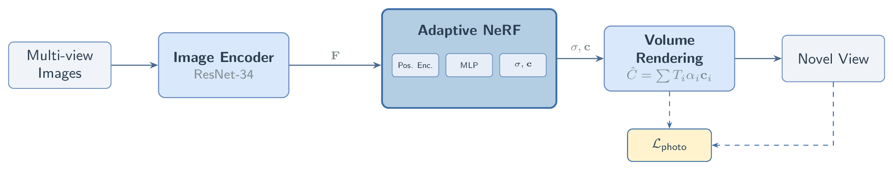
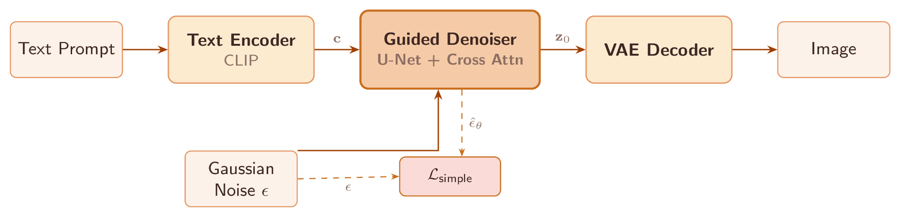
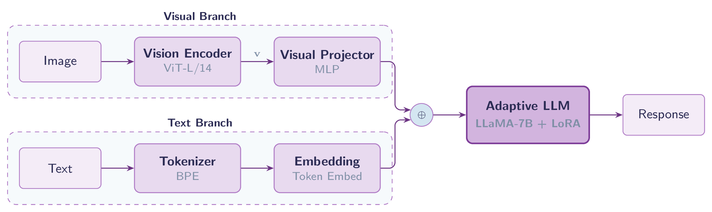
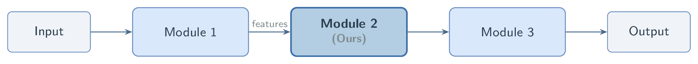
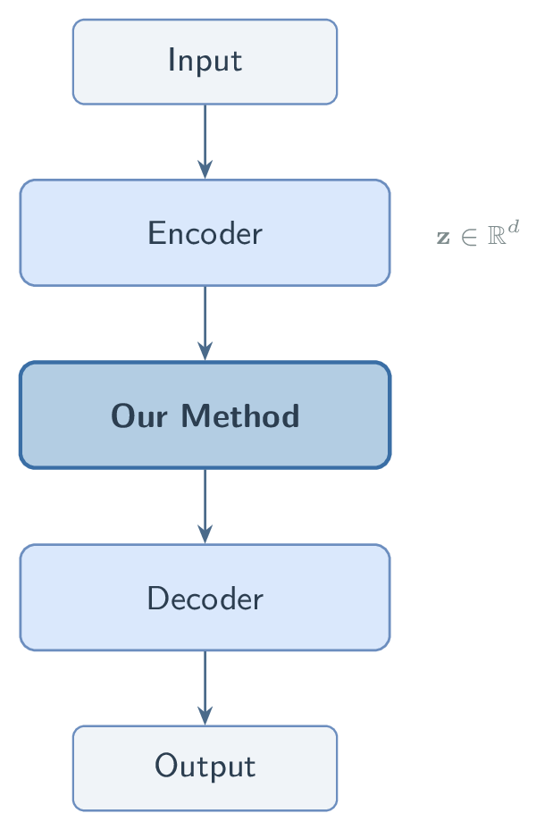
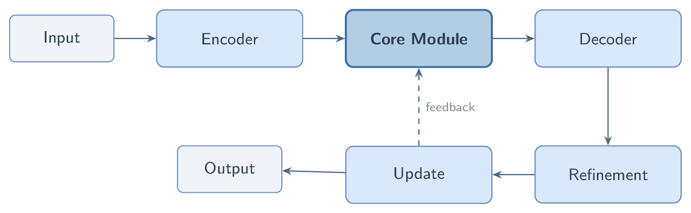
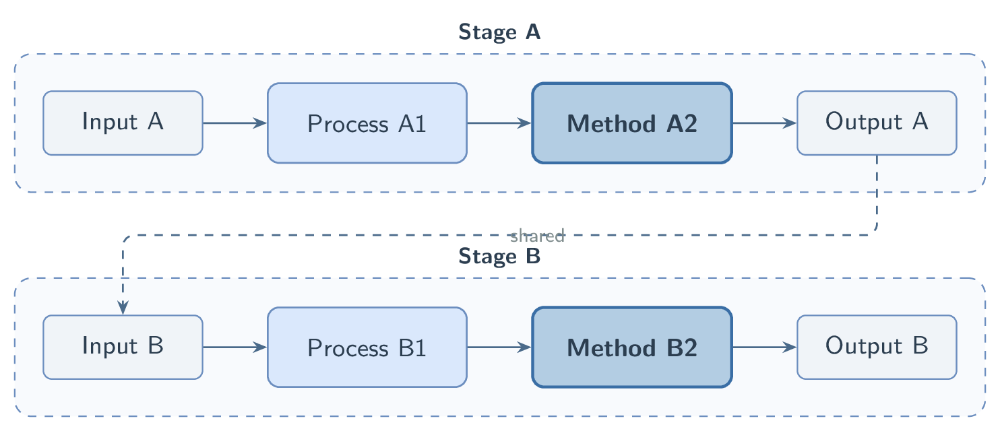
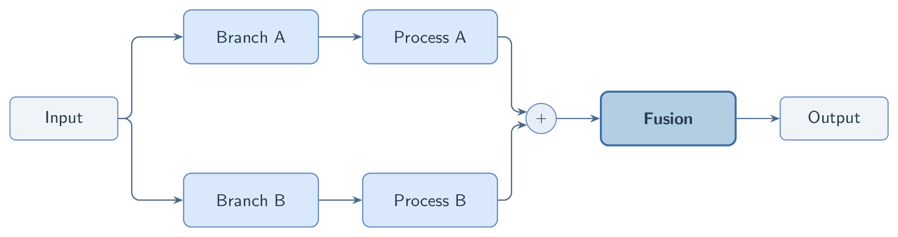

# Research Figure Skill

一个 Claude Code Skill，帮助研究者通过简短对话，从模糊的论文想法/摘要出发，快速生成流程图的草稿。

如果需要高质量的结果，那么还是需要手工使用专业软件对图片进行排版。

## 功能特性

- **卡片式排版**：每个模块用圆角矩形框包裹，箭头连接，结构一目了然
- **低饱和配色**：5 套预定义学术配色方案，专业美观
- **紧凑对齐**：横纵对齐，最小化空白区域
- **自动编译验证**：生成 TikZ 代码后自动编译为 PDF/PNG，AI 自检并修复问题
- **迭代优化**：根据用户反馈反复调整，直到满意为止

## 工作流程

整个流程分为 5 个阶段：

```
Phase 1: 理解方法 → Phase 2: 确认结构(1-2轮) → Phase 3: 生成TikZ → Phase 4: 编译验证 → Phase 5: 展示迭代
```

**你只需要提供论文的摘要或方法描述**，skill 会自动：

1. 提取 pipeline 结构：`输入 → 模块1 → 中间输出 → 模块2 → ... → 输出`
2. 识别哪些模块是 novel contribution（需要视觉突出）
3. 选择合适的排版模板和配色
4. 生成完整可编译的 standalone `.tex` 文件
5. 编译并自检图片质量

## 使用方式

在 Claude Code 中直接描述你的需求即可。以下是一些触发示例：

```
> 帮我画一个方法流程图，我的方法是...

> I need a figure for my paper. The pipeline is...

> Draw my method: we take multi-view images as input, encode features with ResNet...

> 画图：输入文本 → CLIP编码 → 扩散模型去噪 → VAE解码 → 输出图像
```

Skill 会自动激活，引导你完成整个流程。

## 环境要求

- **TeX 发行版**：需要安装 pdflatex（如 MacTeX / TeX Live）
  ```bash
  # macOS
  brew install --cask mactex-no-gui
  # Ubuntu
  sudo apt-get install texlive-full
  ```
- **PDF 转 PNG 工具**（至少安装一个）：
  - `pdftoppm`（推荐，来自 poppler）：`brew install poppler`
  - `gs`（Ghostscript，高质量）：`brew install ghostscript`
  - `convert`（ImageMagick）
  - `sips`（macOS 自带，仅 72dpi，质量较低）

## 项目结构

```
.claude/skills/research-figure/
├── SKILL.md                          # 主 Skill 文件（工作流定义）
├── scripts/
│   └── compile_tikz.sh               # 编译 + 转图片脚本
└── references/
    ├── tikz_elements.md              # TikZ 元素库（模块框、箭头、可视化元素等）
    ├── color_schemes.md              # 5 套预定义配色方案
    └── layout_templates.md           # 5 种排版模板（直线型、环型等）

examples/                             # 使用案例
├── example1_nerf_pipeline.tex        # NeRF 风格 3D 重建 pipeline
├── example1_nerf_pipeline.png
├── example2_diffusion_pipeline.tex   # Text-to-Image 扩散模型 pipeline
├── example2_diffusion_pipeline.png
├── example3_multimodal_llm.tex       # 多模态大语言模型 pipeline
└── example3_multimodal_llm.png
```

## 使用案例

### 案例 1：NeRF 风格 3D 重建 Pipeline

**用户输入：**

> 我的方法是一个基于 NeRF 的新视角合成方法。输入是多视角图像，先用 ResNet-34 编码特征，
> 然后送入我们提出的 Adaptive NeRF 模块（包含位置编码、MLP 预测密度和颜色），
> 再通过体渲染得到新视角图像。训练时用 photometric loss 监督。
> 我们的贡献是 Adaptive NeRF 模块和体渲染的结合。

**生成结果：**

<p align="center">
  <a href="examples/example1_nerf_pipeline.pdf"></a>
</p>

- **配色**：Blue-Gray（经典学术蓝灰）
- **布局**：直线型（从左到右）
- **亮点**：Adaptive NeRF 模块用加粗边框和深色背景突出显示，内部展示了 Pos.Enc → MLP → σ,c 的子模块；底部用大括号标注 "Our Contribution"

### 案例 2：Text-to-Image 扩散模型 Pipeline

**用户输入：**

> 我在做一个 text-to-image 的扩散模型。输入文本经过 CLIP text encoder 编码，
> 得到条件向量 c，送入我们设计的 Guided Denoiser（基于 U-Net + Cross Attention），
> 同时输入高斯噪声。去噪后的 latent z0 经过 VAE Decoder 解码为图像。
> 训练用 simple loss。我们的核心贡献是 Guided Denoiser。

**生成结果：**

<p align="center">
  <a href="examples/example2_diffusion_pipeline.pdf"></a>
</p>

- **配色**：Warm Tones（暖色系，突出创新）
- **布局**：直线型主流程 + 底部噪声输入和 Loss
- **亮点**：Guided Denoiser 用加粗边框突出；高斯噪声从底部通过折线箭头输入；顶部大括号标注贡献

### 案例 3：多模态大语言模型 Pipeline

**用户输入：**

> 我的方法是一个多模态大语言模型。有两个输入分支：图像分支用 ViT-L/14 编码后
> 经过一个 MLP Visual Projector，文本分支用 BPE Tokenizer 处理。两个分支的输出
> 通过 concat 合并，送入我们的 Adaptive LLM（基于 LLaMA-7B + LoRA 微调），
> 输出回复文本。我们的贡献是 Visual Projector 和 Adaptive LLM。

**生成结果：**

<p align="center">
  <a href="examples/example3_multimodal_llm.pdf"></a>
</p>

- **配色**：Purple-Blue（优雅紫蓝）
- **布局**：多分支合并型（双输入分支 → concat → 主模块）
- **亮点**：Visual Branch 和 Text Branch 分别用虚线 group box 包裹；⊕ 符号表示特征拼接；底部大括号标注贡献范围

## 配色方案一览

| 方案 | 风格 | 适用场景 |
|------|------|----------|
| **Blue-Gray** | 经典学术蓝灰 | 通用 pipeline，系统设计图 |
| **Warm Tones** | 暖橙粉黄 | 突出创新，创意方法 |
| **Green-Cyan** | 清新绿青 | 生成类、生物相关 |
| **Purple-Blue** | 优雅紫蓝 | 理论性强、数学相关 |
| **Monochrome** | 灰度渐变 | 极简风格，黑白打印友好 |

## 排版模板一览

| 模板 | 预览 | 适用场景 |
|------|------|----------|
| **直线型（水平）** | <a href=".claude/skills/research-figure/templates/template1_linear_h.pdf"></a> | 最常见，3-6 个阶段的顺序 pipeline |
| **直线型（垂直）** | <a href=".claude/skills/research-figure/templates/template2_linear_v.pdf"></a> | 窄页面，双栏论文单栏图 |
| **环型（U 形）** | <a href=".claude/skills/research-figure/templates/template3_loop_ushape.pdf"></a> | 迭代方法、GAN 训练循环、强化学习 |
| **两模块独立** | <a href=".claude/skills/research-figure/templates/template4_two_independent.pdf"></a> | 多阶段方法（如训练+推理分离） |
| **多分支合并** | <a href=".claude/skills/research-figure/templates/template5_multi_branch.pdf"></a> | 多模态、多尺度、集成方法 |

## 设计原则

这些原则来自学术论文作图的最佳实践：

1. **卡片式排版**：每个模块用圆角矩形框包裹，箭头连接
2. **低饱和配色**：使用柔和的粉彩色调，不使用鲜艳的饱和色
3. **紧凑布局**：最小化空白，元素横纵对齐
4. **无衬线字体**：全程使用 `\sffamily`，现代简洁
5. **突出贡献**：论文的 novel contribution 模块用加粗边框 + 不同背景色视觉区分
6. **2D 可视化元素**：用样式化的图形元素替代纯文字（特征图、网络模块符号等）

## 声明与致谢

本仓库仅供实验室内部参考。

本仓库中关于方法流程图的设计原则与方法论，来源于 [pengsida/Learning_research](https://github.com/pengsida/Learning_research)，感谢 [pengsida](https://github.com/pengsida) 的整理与分享。
