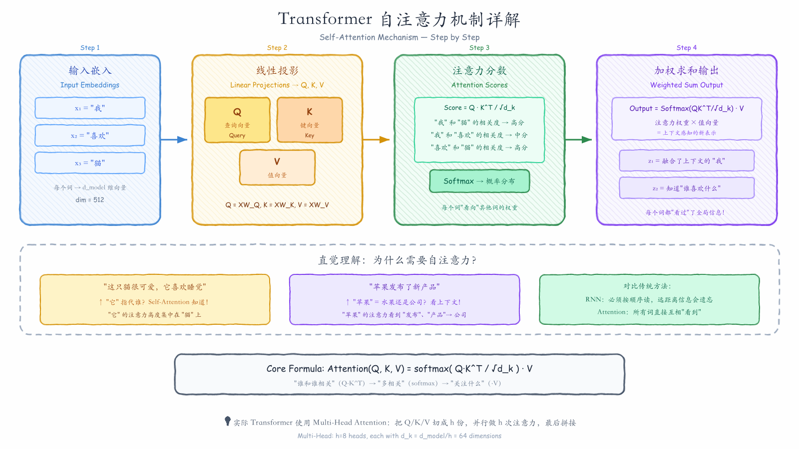
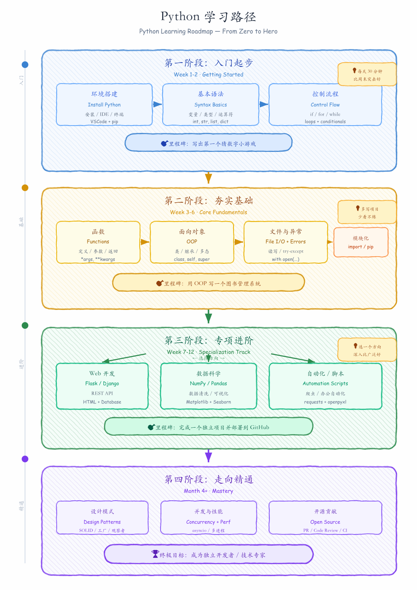
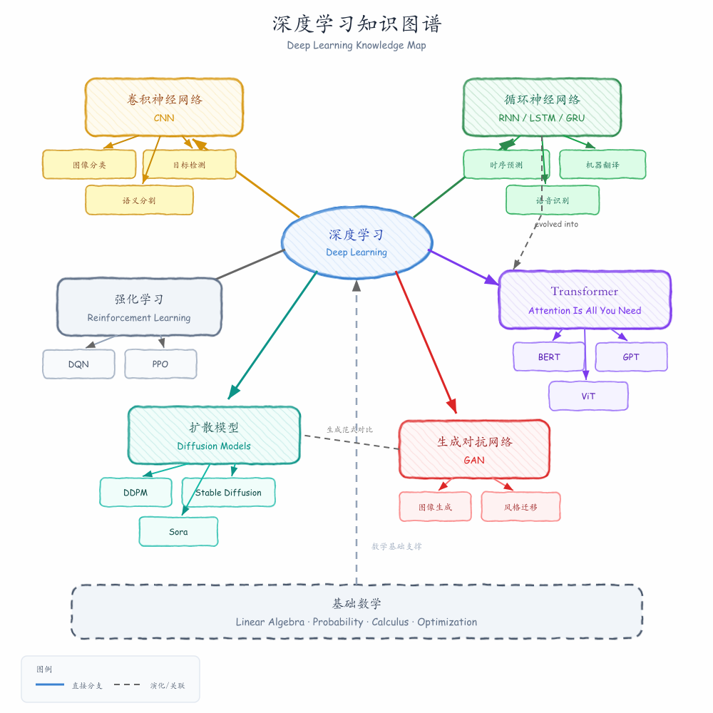

# Research Figure Skills

一组 Claude Code Skills，让 Claude 帮你画出好看的图。支持两种输出格式：

- **LaTeX TikZ** — 学术论文级别的 method pipeline 图，编译为 PDF/PNG
- **SVG 手绘风格** — 零依赖的手绘白板图，适合教学、文档、团队沟通

只需用自然语言描述你想要的图，Claude 自动生成、编译、自检、迭代。

## Gallery

<p align="center">
  
</p>
<p align="center"><em>SVG · Transformer 自注意力机制教学图（16:9）</em></p>

<p align="center">
  
</p>
<p align="center"><em>SVG · 深度学习知识图谱（1:1）&nbsp;&nbsp;|&nbsp;&nbsp;Python 学习路径（A4 竖版）</em></p>


<p align="center">
  
</p>
<p align="center"><em>TikZ · NeRF 3D 重建 Pipeline（学术论文风格）</em></p>


<p align="center">
  
</p>
<p align="center"><em>TikZ · Text-to-Image 扩散模型 &nbsp;|&nbsp; 多模态大语言模型</em></p>

---

# Skill 1: TikZ Research Figure

生成学术论文级别的 method pipeline 图。适合投稿、正式报告。

## 功能特性

- **卡片式排版**：每个模块用圆角矩形框包裹，箭头连接，结构一目了然
- **低饱和配色**：5 套预定义学术配色方案，专业美观
- **紧凑对齐**：横纵对齐，最小化空白区域
- **自动编译验证**：生成 TikZ 代码后自动编译为 PDF/PNG，AI 自检并修复问题
- **迭代优化**：根据用户反馈反复调整，直到满意为止

## 工作流程

整个流程分为 5 个阶段：

```
Phase 1: 理解方法 → Phase 2: 确认结构(1-2轮) → Phase 3: 生成TikZ → Phase 4: 编译验证 → Phase 5: 展示迭代
```

**你只需要提供论文的摘要或方法描述**，skill 会自动：

1. 提取 pipeline 结构：`输入 → 模块1 → 中间输出 → 模块2 → ... → 输出`
2. 识别哪些模块是 novel contribution（需要视觉突出）
3. 选择合适的排版模板和配色
4. 生成完整可编译的 standalone `.tex` 文件
5. 编译并自检图片质量

## 使用方式

在 Claude Code 中直接描述你的需求即可。以下是一些触发示例：

```
> /research-figure 帮我画一个方法流程图，我的方法是...

> /research-figure I need a figure for my paper. The pipeline is...

> /research-figure Draw my method: we take multi-view images as input, encode features with ResNet...

> /research-figure 画图：输入文本 → CLIP编码 → 扩散模型去噪 → VAE解码 → 输出图像
```

Skill 会自动激活，引导你完成整个流程。

## 环境要求

- **TeX 发行版**：需要安装 pdflatex（如 MacTeX / TeX Live）
  ```bash
  # macOS
  brew install --cask mactex-no-gui
  # Ubuntu
  sudo apt-get install texlive-full
  ```
- **PDF 转 PNG 工具**（至少安装一个）：
  - `pdftoppm`（推荐，来自 poppler）：`brew install poppler`
  - `gs`（Ghostscript，高质量）：`brew install ghostscript`
  - `convert`（ImageMagick）
  - `sips`（macOS 自带，仅 72dpi，质量较低）

## 项目结构

```
.claude/skills/research-figure/
├── SKILL.md                          # 主 Skill 文件（工作流定义）
├── scripts/
│   └── compile_tikz.sh               # 编译 + 转图片脚本
└── references/
    ├── tikz_elements.md              # TikZ 元素库（模块框、箭头、可视化元素等）
    ├── color_schemes.md              # 5 套预定义配色方案
    └── layout_templates.md           # 5 种排版模板（直线型、环型等）

examples/                             # 使用案例
├── example1_nerf_pipeline.tex        # NeRF 风格 3D 重建 pipeline
├── example1_nerf_pipeline.png
├── example2_diffusion_pipeline.tex   # Text-to-Image 扩散模型 pipeline
├── example2_diffusion_pipeline.png
├── example3_multimodal_llm.tex       # 多模态大语言模型 pipeline
└── example3_multimodal_llm.png
```

## 使用案例

### 案例 1：NeRF 风格 3D 重建 Pipeline

**用户输入：**

> /research-figure 我的方法是一个基于 NeRF 的新视角合成方法。输入是多视角图像，先用 ResNet-34 编码特征，
> 然后送入我们提出的 Adaptive NeRF 模块（包含位置编码、MLP 预测密度和颜色），
> 再通过体渲染得到新视角图像。训练时用 photometric loss 监督。
> 我们的贡献是 Adaptive NeRF 模块和体渲染的结合。

**生成结果：**

<p align="center">
  <a href="examples/example1_nerf_pipeline.pdf"></a>
</p>

- **配色**：Blue-Gray（经典学术蓝灰）
- **布局**：直线型（从左到右）
- **亮点**：Adaptive NeRF 模块用加粗边框和深色背景突出显示，内部展示了 Pos.Enc → MLP → σ,c 的子模块；底部用大括号标注 "Our Contribution"

### 案例 2：Text-to-Image 扩散模型 Pipeline

**用户输入：**

> /research-figure 我在做一个 text-to-image 的扩散模型。输入文本经过 CLIP text encoder 编码，
> 得到条件向量 c，送入我们设计的 Guided Denoiser（基于 U-Net + Cross Attention），
> 同时输入高斯噪声。去噪后的 latent z0 经过 VAE Decoder 解码为图像。
> 训练用 simple loss。我们的核心贡献是 Guided Denoiser。

**生成结果：**

<p align="center">
  <a href="examples/example2_diffusion_pipeline.pdf"></a>
</p>

- **配色**：Warm Tones（暖色系，突出创新）
- **布局**：直线型主流程 + 底部噪声输入和 Loss
- **亮点**：Guided Denoiser 用加粗边框突出；高斯噪声从底部通过折线箭头输入；顶部大括号标注贡献

### 案例 3：多模态大语言模型 Pipeline

**用户输入：**

> /research-figure 我的方法是一个多模态大语言模型。有两个输入分支：图像分支用 ViT-L/14 编码后
> 经过一个 MLP Visual Projector，文本分支用 BPE Tokenizer 处理。两个分支的输出
> 通过 concat 合并，送入我们的 Adaptive LLM（基于 LLaMA-7B + LoRA 微调），
> 输出回复文本。我们的贡献是 Visual Projector 和 Adaptive LLM。

**生成结果：**

<p align="center">
  <a href="examples/example3_multimodal_llm.pdf"></a>
</p>

- **配色**：Purple-Blue（优雅紫蓝）
- **布局**：多分支合并型（双输入分支 → concat → 主模块）
- **亮点**：Visual Branch 和 Text Branch 分别用虚线 group box 包裹；⊕ 符号表示特征拼接；底部大括号标注贡献范围

## 配色方案一览

| 方案 | 风格 | 适用场景 |
|------|------|----------|
| **Blue-Gray** | 经典学术蓝灰 | 通用 pipeline，系统设计图 |
| **Warm Tones** | 暖橙粉黄 | 突出创新，创意方法 |
| **Green-Cyan** | 清新绿青 | 生成类、生物相关 |
| **Purple-Blue** | 优雅紫蓝 | 理论性强、数学相关 |
| **Monochrome** | 灰度渐变 | 极简风格，黑白打印友好 |

## 排版模板一览

| 模板 | 预览 | 适用场景 |
|------|------|----------|
| **直线型（水平）** | <a href=".claude/skills/research-figure/templates/template1_linear_h.pdf"></a> | 最常见，3-6 个阶段的顺序 pipeline |
| **直线型（垂直）** | <a href=".claude/skills/research-figure/templates/template2_linear_v.pdf"></a> | 窄页面，双栏论文单栏图 |
| **环型（U 形）** | <a href=".claude/skills/research-figure/templates/template3_loop_ushape.pdf"></a> | 迭代方法、GAN 训练循环、强化学习 |
| **两模块独立** | <a href=".claude/skills/research-figure/templates/template4_two_independent.pdf"></a> | 多阶段方法（如训练+推理分离） |
| **多分支合并** | <a href=".claude/skills/research-figure/templates/template5_multi_branch.pdf"></a> | 多模态、多尺度、集成方法 |

## 设计原则

这些原则来自学术论文作图的最佳实践：

1. **卡片式排版**：每个模块用圆角矩形框包裹，箭头连接
2. **低饱和配色**：使用柔和的粉彩色调，不使用鲜艳的饱和色
3. **紧凑布局**：最小化空白，元素横纵对齐
4. **无衬线字体**：全程使用 `\sffamily`，现代简洁
5. **突出贡献**：论文的 novel contribution 模块用加粗边框 + 不同背景色视觉区分
6. **2D 可视化元素**：用样式化的图形元素替代纯文字（特征图、网络模块符号等）

---

# Skill 2: SVG Hand-Drawn Flowchart

用手绘风格的 SVG 生成流程图、知识图谱、学习路径等各类图表。与 TikZ 方案互补——**零依赖、即时渲染、GitHub 直接预览**。

## 为什么选 SVG？

| | TikZ（research-figure） | SVG（svg-creator） |
|---|---|---|
| **依赖** | 需安装 TeX Live / MacTeX | 零依赖，浏览器直接渲染 |
| **渲染速度** | 需要 pdflatex 编译 | 即时，无编译步骤 |
| **风格** | 学术正式，适合论文投稿 | 手绘白板风，适合教学/沟通 |
| **预览** | 需转为 PNG 后查看 | GitHub / 浏览器直接内嵌 |
| **版本控制** | .tex 文本可 diff | .svg 文本可 diff |
| **适合场景** | 论文 method figure | 课件、文档、团队分享、科普 |

## 功能特性

- **手绘美学**：`feTurbulence` + `feDisplacementMap` 实现草图效果，不是冰冷的商业图
- **斜线填充**：模拟手绘交叉阴影，增强手工质感
- **手写字体**：中文用马善政毛笔体，英文用 Comic Sans MS
- **多种比例**：16:9（演示）、4:3（文档）、1:1（社交媒体）、A4（打印）
- **自动验证**：生成后 rsvg-convert 转 PNG，AI 自检布局和箭头
- **色彩分区**：每个模块独立配色，层次分明

## 使用方式

在 Claude Code 中描述你想要的图即可：

```
> /svg-creator 画个图：Transformer 自注意力机制的工作原理

> /svg-creator 帮我可视化一下深度学习各分支的关系

> /svg-creator draw a diagram: Python learning path from beginner to expert

> /svg-creator 画个流程图，1:1 比例，展示...
```

## 使用案例

### 案例 1：Transformer 自注意力机制详解

**用户输入：**

> /svg-creator 帮我画一个 Transformer 自注意力机制的教学图。要分步讲解：输入嵌入 → Q/K/V 投影
> → 注意力分数计算 → 加权求和输出。比例 16:9，适合放 PPT。
> 底部加一段"直觉理解"，举例说明为什么需要 self-attention。

**生成结果：**

<p align="center">
  
</p>

- **比例**：16:9（演示/PPT 友好）
- **布局**：左到右四阶段流水线
- **配色**：蓝→橙→绿→紫，每阶段独立色系
- **亮点**：底部"直觉理解"用虚线框包裹，举了指代消解和多义词两个真实例子；核心公式单独高亮

### 案例 2：深度学习知识图谱

**用户输入：**

> /svg-creator 画一个深度学习的知识图谱，1:1 比例。中心是"深度学习"，
> 分支包括 CNN、RNN、Transformer、GAN、扩散模型、强化学习。
> 每个分支下面挂 2-3 个代表性应用或模型。
> 用虚线标注分支之间的演化关系（如 RNN → Transformer）。

**生成结果：**

<p align="center">
  
</p>

- **比例**：1:1（正方形，适合社交媒体/笔记）
- **布局**：放射状，中心向六个方向发散
- **配色**：六色分区（蓝/橙/绿/紫/红/青），底部数学基础用灰色
- **亮点**：虚线标注演化关系（RNN → Transformer）；底部"基础数学"用虚线框表示支撑关系；左下角图例

### 案例 3：Python 学习路径

**用户输入：**

> /svg-creator 画一个 Python 学习路径图，A4 竖版。分四个阶段：入门（环境搭建、语法、控制流）→
> 基础（函数、OOP、文件）→ 进阶（分三条路：Web开发、数据科学、自动化脚本）→
> 精通（设计模式、并发、开源贡献）。每个阶段有一个里程碑标记。

**生成结果：**

<p align="center">
  
</p>

- **比例**：A4 竖版（1000×1414，适合打印/手机阅读）
- **布局**：自上而下四层阶梯，第三层带三向分支
- **配色**：蓝→橙→绿→紫，层层递进
- **亮点**：左侧竖线进度指示器；第三阶段"选择方向"三条路分叉；右侧小贴士气泡增添趣味；每层底部里程碑标记

## 设计原则

1. **手绘而非机械**：通过 SVG filter 让直线有微小抖动，看起来像白板手画
2. **箭头永不加 filter**：这是 #1 踩坑点——`feDisplacementMap` 会让细线消失
3. **斜线填充 + 半透明底色**：兼顾视觉质感和文字可读性
4. **字体一致**：中文统一马善政，英文统一 Comic Sans，不混用其他手写体
5. **色彩克制**：每种颜色对应一个语义分区，避免彩虹噪音
6. **比例适配内容**：横向流程用 16:9，层级结构用 A4，概念关系用 1:1

---

## 声明与致谢

本仓库仅供实验室内部参考。

本仓库中关于方法流程图的设计原则与方法论，来源于 [pengsida/Learning_research](https://github.com/pengsida/Learning_research)，感谢 [pengsida](https://github.com/pengsida) 的整理与分享。
